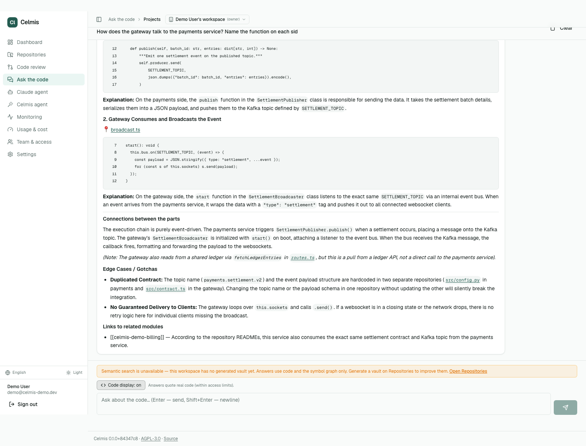
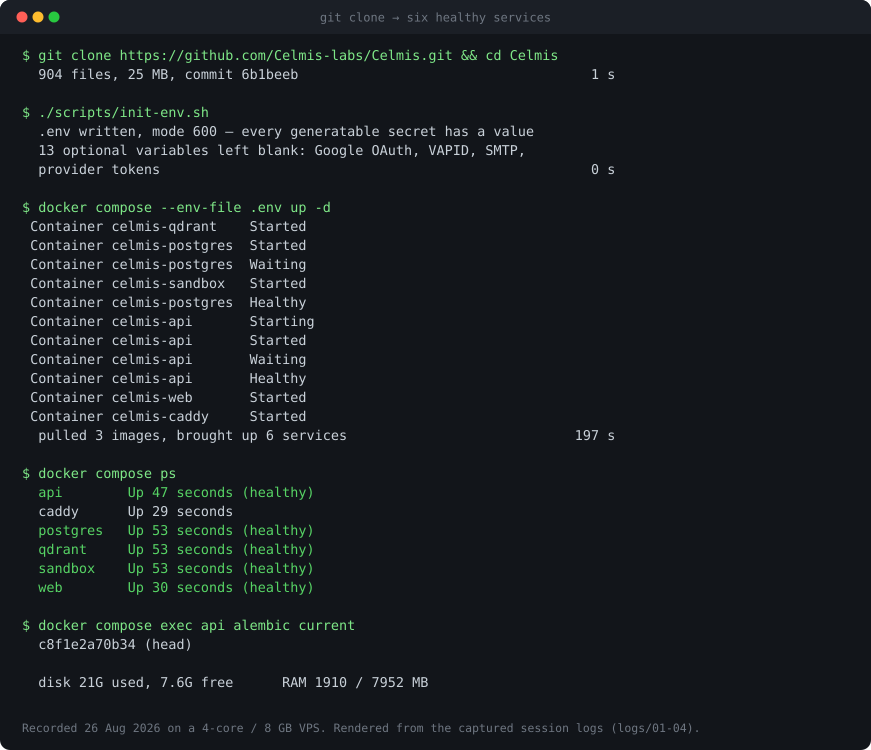
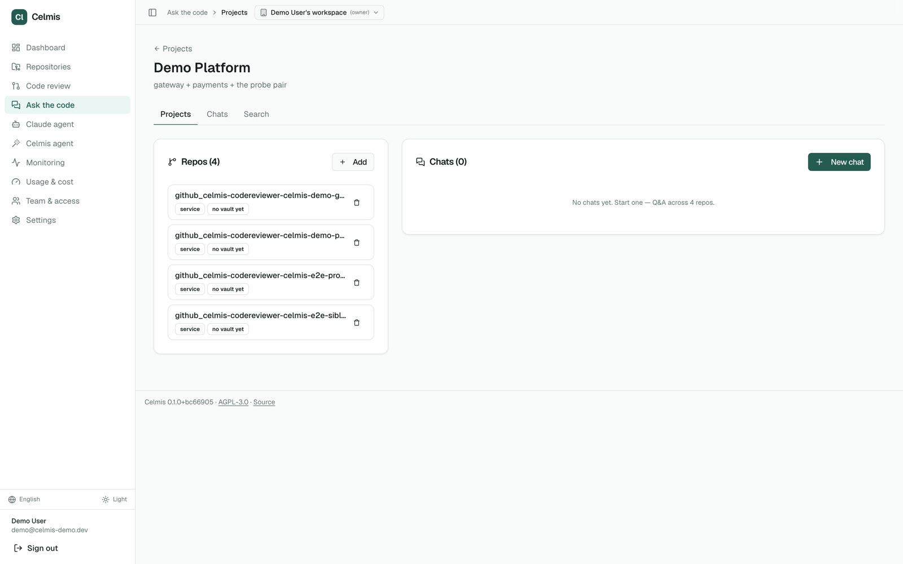
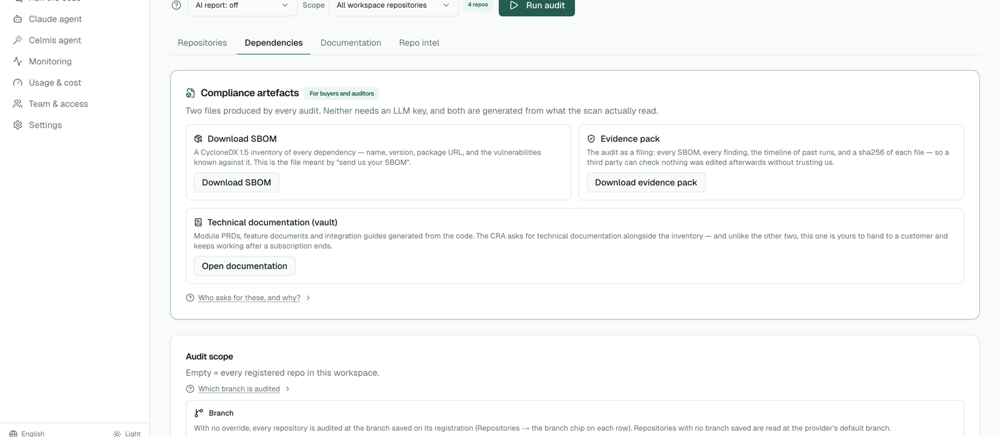
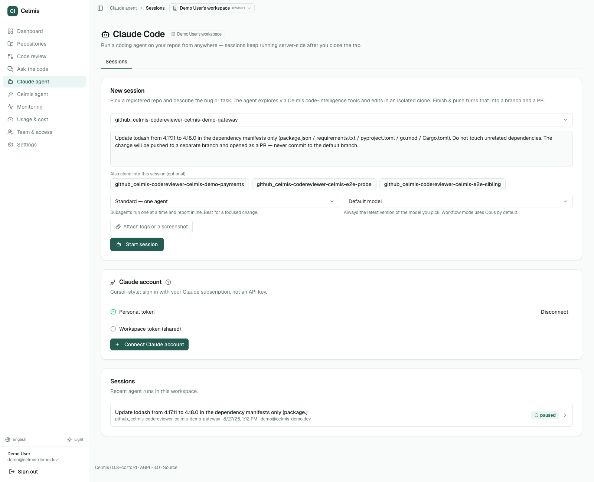
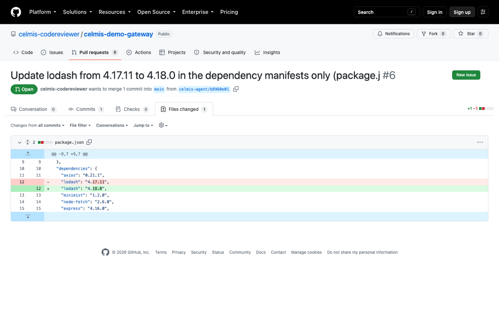
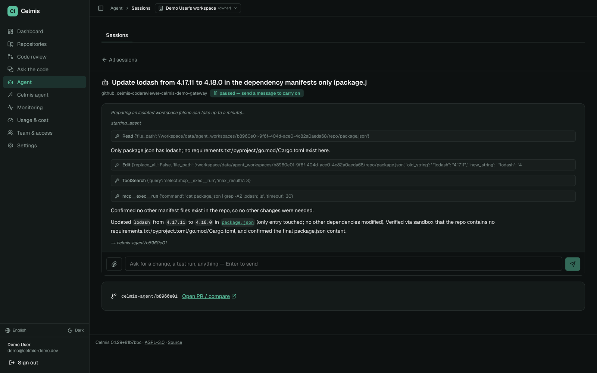
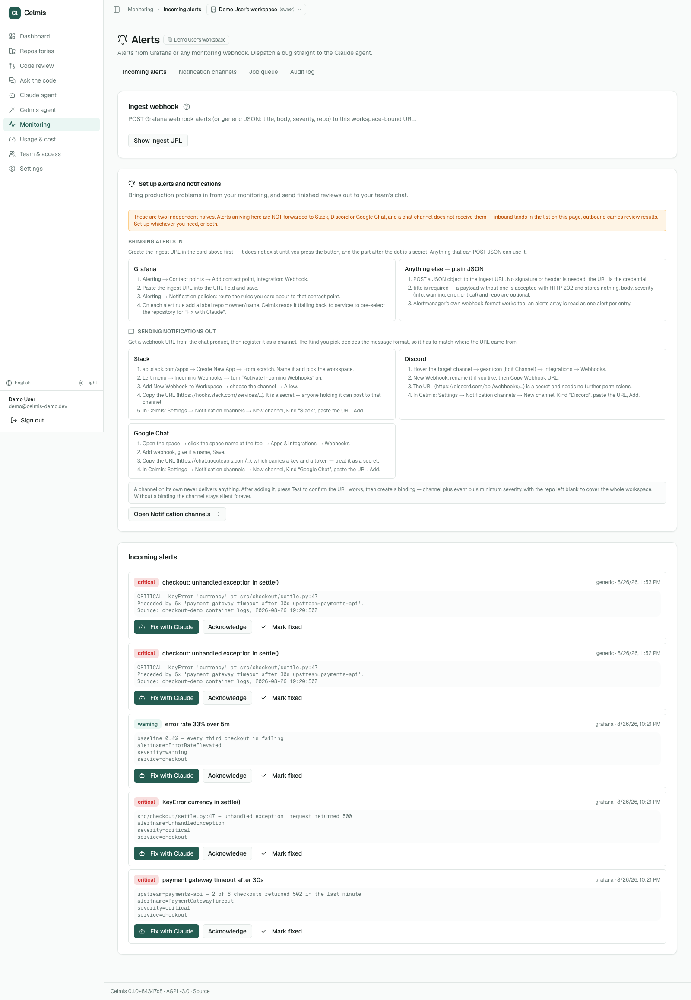
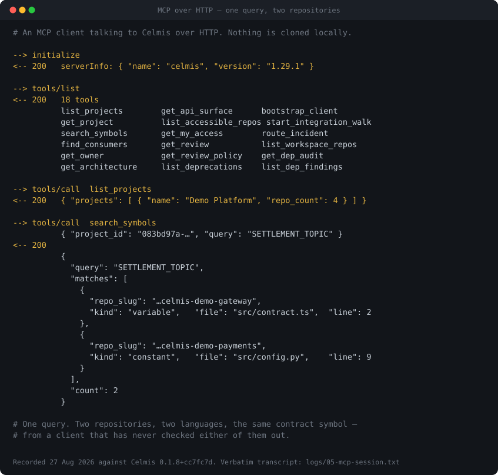

<div align="center">

# Celmis

**Self-hosted code intelligence — ask your codebases, review pull requests, and produce the evidence an auditor asks for**

[**celmis-labs.github.io**](https://celmis-labs.github.io) · [Documentation](https://celmis-labs.github.io/docs/) · [Quick start](#quick-start) · [Results](#results)

</div>

Celmis reads your repositories once and keeps a symbol graph of them. Everything
else — questions, reviews, dependency audits, generated documentation — is a
different way of reading that graph. It runs on one machine under
`docker compose`, with the model provider of your choice behind it, and nothing
leaves your network except the calls you configure.

In the oldest telling, Kelmis was the smelter — one of the three Idaean Dactyls,
alongside Damnameneus the hammer and Acmon the anvil, to whom the working of iron
was credited. The index does the reducing here; the surfaces are what work the
result.

## What that buys you that a diff-only tool cannot

Ask a question that spans two repositories, and the answer quotes both:



That is not a search result. The gateway and the payments service are separate
repositories with no shared code, and the answer traces the call chain between
them — then notices, unprompted, that the Kafka topic name is hardcoded in both
and that changing one silently breaks the other.

A reviewer that reads only the diff structurally cannot say that. It never had
the other repository open.

---

## Nine things people do with it

| | |
|---|---|
| **You are a PM, a delivery lead or the client** and want to know what state a group of projects is in, or how something actually works | Ask it. From any device, anywhere, without booking time from an engineer and without a meeting whose only output is a paragraph → [Ask the code](#ask-the-code) |
| **A new engineer has a question a senior would have to answer** | Every one of those pulls someone experienced out of flow, at the moment they are already covering. The codebase answers instead, with file:line citations → [Ask the code](#ask-the-code) |
| **Two teams share an integration and neither can read the other's repository** | Load it, grant the right to ask, and deny the paths that must stay private. They get answers; the credentials are refused at the source → [Who can see what](#who-can-see-what) |
| **A customer or an auditor asks for your SBOM** | One button, CycloneDX, plus an evidence pack whose manifest lets them verify it without trusting you → [Dependencies, SBOM and the evidence pack](#dependencies-sbom-and-the-evidence-pack) |
| **A vulnerability lands in a dependency** | *Fix with Claude* hands an embedded session the repository, the package and the finding. It edits, the runner pushes a branch and opens a PR → [Fix with Claude](#fix-with-claude) |
| **A pull request needs reviewing** | Agents read the diff — and, where the graph is built, who else calls what is being changed, including from another repository → [Pull-request review](#pull-request-review) |
| **Forty services need the same thing done to them** | Write the sentence. Celmis shows which repositories it resolves to and waits for a second press, rather than finding them among forty and pressing a button forty times → [Ask for work across repositories](#ask-for-work-across-repositories) |
| **An alert fires at 02:00 and you are not at a desk** | It lands in Celmis, a web push reaches your phone, and *Fix with Claude* opens a session already holding the alert. The runner opens the pull request → [Alerts, and fixing from a phone](#alerts-and-fixing-from-a-phone) |
| **Your own agent or editor needs to understand the codebase** | Point it at `/mcp/`. Eighteen tools over the same index, under the same access rules — no second copy of your code anywhere → [Connect Claude Code and other MCP clients](#connect-claude-code-and-other-mcp-clients) |

The first three are the ones a code-review tool does not do at all, and they are
the reason this is a platform rather than a reviewer: index once, then read that
index from whichever side of the work you are standing on.

## Three numbers

| | |
|---|---|
| **197 seconds** | from `git clone` to six healthy services, measured on a clean server |
| **$0.118** | per pull request reviewed, on the model this ships with |
| **17th of 50** | on the Martian Code Review Bench offline set, under all three judges |

That last one is deliberately unflattering, and it stays. It measures one of the
surfaces below — pull-request review on isolated single-repository PRs — and
that set has no sibling service for a symbol to have consumers in, so the thing
this product is built around is not in the number at all. The table, the audit
of every finding it scored false, and the command that reproduces both are in
[Results](#results).

## Table of contents

- [What that buys you that a diff-only tool cannot](#what-that-buys-you-that-a-diff-only-tool-cannot)
- [Nine things people do with it](#nine-things-people-do-with-it)
- [Three numbers](#three-numbers)
- [Quick start](#quick-start)
- [First user and admin](#first-user-and-admin)
- [Connect a repository](#connect-a-repository)
- [Ask the code](#ask-the-code)
- [Pull-request review](#pull-request-review)
- [Dependencies, SBOM and the evidence pack](#dependencies-sbom-and-the-evidence-pack)
- [Fix with Claude](#fix-with-claude)
- [Alerts, and fixing from a phone](#alerts-and-fixing-from-a-phone)
- [Ask for work across repositories](#ask-for-work-across-repositories)
- [Who can see what](#who-can-see-what)
- [Languages and formats](#languages-and-formats)
- [Deterministic checks — no model, no false positives](#deterministic-checks-no-model-no-false-positives)
- [Connect Claude Code and other MCP clients](#connect-claude-code-and-other-mcp-clients)
- [Results](#results)
- [Audit of the false positives](#audit-of-the-false-positives)
- [Test repositories](#test-repositories)
- [Configuration](#configuration)
- [Operations](#operations)
- [Local development](#local-development)
- [CLI reference](#cli-reference)
- [Architecture](#architecture)
- [Troubleshooting](#troubleshooting)
- [Project layout](#project-layout)
- [Provenance and rights](#provenance-and-rights)

## Quick start

### What you need

| | | |
|---|---|---|
| **Docker** | 24+ with Compose v2 | Docker Desktop on macOS/Windows, the native engine on Linux |
| **A model API key** | one of | Google Gemini, Anthropic, OpenAI, OpenRouter, Groq or Mistral. A free Gemini key is enough to evaluate: <https://aistudio.google.com/app/apikey> |
| **RAM** | ~4 GB free | Measured on a real indexing run: 1.1 GB peak across all five containers, 565 MB at rest |

Postgres and Qdrant are **bundled** — no external cluster to provision. No
Python or Node.js install is needed for the Docker flow.

### Start it

```bash
git clone <your-fork-url> celmis
cd celmis

# Generates .env and fills every secret in the format each one needs.
# Idempotent: run it again after a pull and it fills only the new blanks.
./scripts/init-env.sh

docker compose --env-file .env up -d

# Wait for healthy — first boot pulls three images and applies migrations
docker compose ps
```

Open <http://localhost>.

Nothing is built here. The three images are pulled from the registry named by
`CELMIS_REGISTRY` at the tag in `CELMIS_TAG`, for `linux/amd64` and
`linux/arm64` — Apple Silicon and an ARM server both get a native image.
Building them on the machine that runs them was measured at 485 seconds and
4.2GB of disk for `api` alone, which is why installing no longer means
compiling.

Port 80, not 3000: a reverse proxy puts the app and its API on one origin and
serves the API under `/backend`. That is not a deployment preference — the
browser bundle asks for a relative path, which is the only way one published
image can serve every installation instead of just the one it was built on.

To work ON Celmis rather than run it, add the dev overlay and you get local
builds back:

```bash
docker compose -f docker-compose.yml -f docker-compose.dev.yml up -d --build
```

`init-env.sh --check` reports what is still empty without writing anything.



That is a **render of the captured session**, not a screen recording — the
figures in it are the ones the run produced on 26 August 2026, and the compose
output is verbatim from `logs/03-up.log` in the install report. It is drawn
rather than photographed because a second stack cannot be brought up beside a
running one: `docker-compose.yml` fixes `container_name`, so the names collide.

### Stop

```bash
docker compose down       # stop, keep your data
docker compose down -v    # stop and DELETE every volume
```

---

## First user and admin

The sign-up form on `/login` works as soon as the stack is healthy. That
account is a **normal user** — signing up grants no admin rights, not even to
the first person through the door.

Global admin comes from the environment instead: sign in with
`CELMIS_MASTER_EMAIL` and `CELMIS_MASTER_KEY` (as the password), both in
`.env`. Whoever runs the box is the admin, which is the model a self-hosted
install wants rather than whoever reached the form first. The path does not
exist unless both variables are set, and every use of it is written to the
audit log.

To promote a normal account:

```bash
docker compose exec api analyzer auth make-admin you@example.com
```

---

## Connect a repository

1. **Settings → LLM Setup** — paste a provider key. It is encrypted with
   `CREDENTIAL_MASTER_KEY` before it touches the database, and the UI only
   ever shows you the first and last four characters again.
2. **Connections** — add a GitHub, GitLab or Bitbucket token. Use a **machine
   account**, not your own: a personal token reaches every repository you can
   see, and tokens end up in backups, logs and screenshots.
3. **Repositories → Add** — pick repositories from the provider, or paste a
   clone URL. Indexing is queued; the job shows on the same page.

Indexing builds two things from the same checkout: a symbol graph (definitions,
calls, imports — what the review agents reason over) and embeddings in Qdrant
(what Q&A retrieves). A 120k-symbol repository takes about a minute on four
cores.

Twenty-three languages parse into the graph. A file in a language without a
parser is said so out loud rather than silently skipped — `analyzer graph-stats`
lists what was and was not read.

---

## Ask the code

A question in a chat, answered with **file:line citations** from as many
repositories as you point it at. Answers stream as they are written.

Group repositories into a project, and the question is asked of the group:



Answers quote real code, and only the code the asker is allowed to see — which
is what makes it safe to hand the question to someone outside the team that
owns the repository. See [Who can see what](#who-can-see-what).

## Pull-request review

Agents read the diff and post findings to GitHub, GitLab or Bitbucket. Rather
than show that in a screenshot of this interface, the reviews are left where
they were posted — fifty pull requests on real projects, with the comments still
attached to the lines they were written about. They are listed under
[Test repositories](#test-repositories), and the output there is unedited,
including the findings the audit below marks wrong.

Where the graph is built, the review also carries what the diff does not show:
who else calls the symbol being changed, including from another repository.
Where it is not built, the review still runs — it just answers the narrower
question, which is what the benchmark measured.

Every finding the benchmark scored false was opened in the source and published
with a verdict. Thirty-three of seventy-nine turned out to be real defects the
gold set does not contain. That work is in
[Audit of the false positives](#audit-of-the-false-positives), with the code and
a permalink for each, so you can disagree with any of them.

## Dependencies, SBOM and the evidence pack

The dependency audit is **deterministic**: native auditors where the tool is
installed, OSV everywhere else, no model involved. A language model, if you give
it a key, writes the summary — it does not decide what is vulnerable.



Two files come out of every audit, and neither needs an LLM key:

- **SBOM** — a CycloneDX inventory of every dependency, its version, package URL
  and the vulnerabilities known against it. This is the file people mean when
  they say "send us your SBOM".
- **Evidence pack** — the audit as a filing: every SBOM, every finding, the
  timeline of past runs, and a sha256 of each file, so a third party can check
  nothing was edited afterwards *without having to trust us*. A folder whose
  contents can be changed later proves nothing; the manifest is what makes it
  evidence.

Alongside them, the generated technical documentation — module PRDs, feature
documents and integration guides written from the code — which is yours to keep
and keeps working after any subscription ends.

**Why this exists now.** From **11 September 2026** the EU Cyber Resilience Act
requires a manufacturer to report an actively exploited vulnerability to ENISA
within 24 hours. The formal SBOM mandate lands in December 2027, but you cannot
answer the 24-hour question without component-level visibility first — to report
what is affected, you have to know what is inside.

**Celmis does not claim compliance, and will not.** It produces the artefacts a
filing needs. Whether a filing is adequate is a lawyer's judgement, and a tool
that implies otherwise is selling a false sense of safety.

One more thing the audit page says out loud, because it is the failure nobody
looks for: **an ecosystem nobody scanned reports zero vulnerabilities exactly
like a clean one.** Coverage is shown next to the findings — which auditor
produced each result, and, more usefully, what went unchecked and why.

## Fix with Claude

Finding something is half a loop. An embedded Claude Code session runs **inside**
the installation, edits the checkout, and the runner commits, pushes a branch and
opens a pull request.

### It runs on your subscription, on your machine

There is no key to buy from us and no model bundled. You connect **your own Claude
subscription**, the way Cursor does it: run `claude setup-token` once on your own
laptop and paste the token into Settings. It is stored encrypted in the credential
store, and the session that runs later uses it.

Two slots, resolved in that order:

| | |
|---|---|
| **Personal** | your own subscription, visible to nobody else |
| **Workspace** | one subscription an admin shares with the workspace — explicit opt-in |

The workspace slot is off unless someone turns it on, and the interface says why
before you save: **sharing one person's subscription across several people may
breach Anthropic's consumer terms.** That is a decision for whoever holds the
subscription, and the product will not make it quietly.

And the session is not running in somebody's cloud. It runs on **your own
installation**, in a workspace isolated per session. What that buys you is not
"cloud access" — it is that the machine holding your code is one you control, and
you reach it from a laptop in an office or a phone on a train for the same reason
you reach any service you run: because it is yours and it is up.

That is the whole of [Alerts, and fixing from a phone](#alerts-and-fixing-from-a-phone)
— an alert arrives, and the fix starts from wherever you happened to read it.

A vulnerability in the dependency audit carries a **Fix with Claude** button. It
does not open an empty chat — it hands the session the repository, the package,
both versions and the boundaries of the job, already written:



Here is one such loop, end to end, on a real finding — `lodash 4.17.11` with a
known vulnerability against it. **220 seconds** from *Start session* to an open
pull request, in five turns:

```
Read package.json
  → "Only package.json has lodash; no requirements.txt/pyproject/go.mod exist here."
Edit package.json: "lodash": "4.17.11" → "4.18.0"
mcp__exec__run: cat package.json | grep -A2 lodash; ls
  → "Confirmed no other manifest files exist, so no other changes were needed."
```

The branch it pushed, and the pull request it opened, on GitHub:



Look at what is *not* in that diff. `axios 0.21.1`, `minimist 1.2.0`,
`node-fetch 2.6.0` sit on the lines directly above and below — all outdated, all
flagged in the same audit — and all untouched. The task said manifests only, and
an agent that tidied three more on the way past would have been a worse result
to review, not a better one.

It is a live pull request, not a screenshot:
**[celmis-demo-gateway#6](https://github.com/celmis-codereviewer/celmis-demo-gateway/pull/6)**
— branch `celmis-agent/b8960e01`, one commit, `+1/-1`.



Two details in that transcript are worth more than the diff. The agent did not
*assume* there were no other manifests — it ran a command in the sandbox to
check. And the task said "manifests only, do not touch unrelated dependencies",
so the change is exactly one line.

### What the runner allows, and what it does not

This is decided by the runner, not by the prompt — which is the part worth
reading before you grant an agent anything:

- **No shell of its own.** `Bash`, `WebFetch`, `WebSearch` and notebook editing
  are disallowed. Commands run through the sandbox container, which is a
  separate service with its own uid and a read-only root filesystem.
- **Git is the runner's job.** The agent never commits or pushes. When the work
  is done — or when you press *Finish & push* — the runner makes the commit,
  pushes the branch and opens the PR. Never to the default branch.
- **A provider limit is a pause, not a loss.** The first attempt at the run above
  hit a weekly account limit mid-session. The session did not die: it moved to
  `paused`, kept its work resumable for fourteen days, and showed the provider's
  own message rather than a generic failure. A second key finished it.
- **The session is watchable.** Output streams over SSE with replay, so a
  reconnect picks up where it left off instead of starting blank.

Connection is a setup token, held per user or per workspace. The API never
returns it once saved — only whether it is there and whether it still works.

## Alerts, and fixing from a phone

The loop above starts from a dependency finding. It also starts from production.

Point any monitoring system at the workspace's ingest URL and its alerts land in
Celmis:

```
POST /webhook/alerts/{workspace_id}.{secret}
```

Grafana's unified alerting webhook is parsed as-is; anything else can post
`{"title", "body", "severity", "repo"}`. The secret half is stored Fernet-encrypted
per workspace and compared in constant time. The endpoint is **unauthenticated by
design** — monitoring systems cannot do OAuth — and **tenant-bound by
construction**: a token can only ever write into the workspace it belongs to.

What that buys is the route with no laptop in it:

1. An alert fires. It reaches Celmis and a web push notification reaches your phone
   — real web push, VAPID and a service worker, so it arrives whether or not the tab
   is open.
2. You open it. The alert carries its repository, because `route_incident` can take
   a stack trace and say which repository and which owner it belongs to.
3. You press **Fix with Claude**. The session opens already holding the alert — not
   an empty chat.
4. The runner commits, pushes a branch and opens the pull request.



None of those four steps needs a checkout, a terminal, or a machine you trust. The
work happens inside your own installation; the phone is a screen for it.

The same page lists every alert the workspace has received, so an alert that nobody
acted on is visible rather than lost in a channel.

**What is written down while this happens.** Two separate records, and they answer
different questions:

- **The audit trail** — append-only JSONL, rotated by size, filterable by time,
  mode, operation and repository, exportable as CSV. It answers *who did what, to
  which repository, when*. Retention defaults to 90 days and the active file is
  never deleted, only rotated archives.
- **Resource history** — samples and aggregates over the installation itself,
  exportable as CSV for a sizing sheet. It answers *what did this cost to run*.

An agent session that edits a repository at two in the morning from somebody's phone
is exactly the kind of event that has to be reconstructable afterwards. It is.

## Ask for work across repositories

Every surface above acts on one thing at a time: this repository, this pull
request, this finding. That is the right shape for a button, and the wrong shape
for a set defined by a condition.

*Generate documentation for every service that has none* is one sentence. Through
the interface it is finding them among forty and pressing a button forty times.
*Audit everything under `acme-ai` that has not been audited in thirty days* needs
filters, saved selections and bulk operations — a subsystem — or it needs a
sentence.

So there is a sentence box, and a deliberately short catalogue of verbs behind it.
Single-object work stays on the buttons, where it belongs.

**Nothing runs on the first press.** Interpretation is a guess, and these verbs
cost money and hours — a vault build, a fleet of review agents, an audit across a
group. So the answer to a sentence is not the work; it is *which repositories this
resolves to*, listed, with a second button under them. You confirm the set, not
the intent.

**The scope is re-checked at the moment you confirm, not when you asked.** A
repository registered in the seconds between the question and the press cannot
quietly join a set that said "everything". The same rule that governs the rest of
the product — the check runs where the work happens — governs this.

**An automated caller can never enqueue an unbounded fan-out.** The verbs are
capped, workspace-scoped, and take an explicit actor: nothing here reads an
ambient request context, because a connector processing a queue has no request,
and a function that guesses at a workspace is the way one tenant's automation
reaches another tenant's repositories.

Three callers are converging on these same verbs — an external agent over MCP, the
embedded agent, and a ticket connector that turns *audit these four services* into
work and posts the result back. They share one implementation on purpose: a second
"start an audit" is a second set of rules about live runs, deduplication and forced
restarts, and the copy nobody maintains is the one that corrupts the queue.

## Who can see what

Access is resolved per repository, per team, and it governs every surface at
once — Q&A, graph, search, MCP:

| setting | effect |
|---|---|
| `visibility: none` | the repository does not exist for research |
| `visibility: metadata` | documentation and architecture notes only |
| `visibility: code` | source is readable |
| `deny_globs` | **wins even at `code`** — credentials, crypto, database connections, secret verification |
| `allow_globs` | an allow-list when set; deny still subtracts from it |

This is what makes the neighbouring-team case work rather than being a promise:
load the repository, grant the other team the right to ask, and deny the paths
that must not be read. They get answers; those files are refused at the source,
not filtered out of a response that already contained them.

## Languages and formats

Seventeen graph modules, plus a generic path through tree-sitter tag queries for
languages without one:

**Code** — Python, TypeScript, JavaScript, Go, Java, C#, C++, PHP, Vue, and more
through the generic path.

**Infrastructure** — Dockerfile, docker-compose, Helm, Kubernetes manifests,
Terraform and CI workflows. This is the part most code-intelligence tools skip,
and it is why a question can cross from a function to the service definition
that runs it.

## Deterministic checks — no model, no false positives

Every check below is decided by reading files. No language model takes part in
deciding that something is wrong, so the false-positive rate is zero by
construction rather than by tuning.

That distinction is the whole point. Around twenty percent false positives is
where developers stop reading a tool's comments at all — one costs seconds of
attention, a thousand costs you a team that has learned to skip everything the
tool says. A model is used here to explain and to prioritise, never to detect.

| Check | Reads | Catches |
|---|---|---|
| `install_script` | `package.json` lifecycle hooks | a dependency that runs code at install time |
| `python_build_hooks` | `pyproject.toml` / `setup.py` | build-time code execution in a Python package |
| `cargo_build_script` | `Cargo.toml` | a crate with a `build.rs` |
| `non_registry` | manifests and lock files | a dependency pulled from a git URL or tarball instead of a registry |
| `suspect_name` | the dependency list | typosquats — a name one edit away from a popular package |
| `lock_drift` | manifest vs lock file | a lock file that no longer matches what the manifest declares |
| `cross_repo_drift` | the PR diff, then sibling repositories | a constant changed in one repository and left behind in the others |

Ordinary CVE scanning is deliberately **not** on that list. OSV-Scanner already
does it, it is free, and it is the de-facto standard — Celmis runs it (plus each
ecosystem's own auditor: `pip-audit`, `npm audit`, `govulncheck`,
`cargo audit`) and treats the result as an input rather than as a feature.

**On compliance.** Celmis produces the artefacts an audit asks for — a
CycloneDX SBOM, a dependency inventory, a findings history with timestamps and
the evidence each finding rests on. It **does not claim your filing is
adequate**, and no tool honestly can: what an auditor accepts depends on your
sector, your jurisdiction and your own controls. Produce the artefacts; let
the people whose job it is assess them.

---

## Connect Claude Code and other MCP clients

Celmis exposes its index over MCP, so an agent can search symbols, read API
surfaces and find consumers instead of grepping a checkout it does not have.

**Over HTTP** (the running stack serves it at `/mcp/`):

```bash
# Mint a token (or issue one from Settings → MCP in the UI)
docker compose exec api analyzer mcp issue-token \
  --scopes "read:graph read:groups" --duration 86400
```

```jsonc
// ~/.claude.json  (or .mcp.json in a project)
{
  "mcpServers": {
    "celmis": {
      "type": "http",
      "url": "http://localhost:8000/mcp/",
      "headers": { "Authorization": "Bearer <the token you just minted>" }
    }
  }
}
```

**Over stdio**, without the HTTP hop:

```jsonc
{
  "mcpServers": {
    "celmis": {
      "command": "docker",
      "args": ["compose", "exec", "-T", "api", "analyzer", "mcp", "serve"]
    }
  }
}
```

### What an agent can ask

The HTTP mount serves **18 tools**. They answer the questions a grep cannot:

| | |
|---|---|
| `list_workspace_repos` | which repositories exist, indexed, documented, auto-review on |
| `search_symbols` | where a function or endpoint is defined, across a whole project |
| `find_consumers` | which repositories call a symbol — including ones you never cloned |
| `get_api_surface` | the HTTP handlers a service actually exposes |
| `get_owner` · `list_deprecations` | who owns a file; what is on the way out and who still uses it |
| `route_incident` | given a stack trace, which repository and owner it belongs to |
| `bootstrap_client` · `start_integration_walk` | what a client needs to call another team's service |
| `get_dep_audit` · `list_dep_findings` | the last audit and its findings, worst first |
| `get_review` · `get_review_policy` | the latest review of a PR, and which agents run where |

**The two transports are not the same set.** `analyzer mcp serve` over stdio
serves 13 older, graph-shaped tools (`find_symbol`, `find_callers`,
`query_graph`); the HTTP mount serves the 18 above. Neither is a subset of the
other — pick the transport for the tools you want.

A step-by-step guide, with the scopes each tool needs and the failure modes,
is in [`.claude/skills/celmis-mcp/SKILL.md`](.claude/skills/celmis-mcp/SKILL.md).
Claude Code picks it up automatically when this repository is open.

---

### What the agent can ask for



One `search_symbols` call, one contract symbol, and it comes back from two
repositories in two languages — to a client that has checked out neither. The
boundary a diff never crosses is the one this makes ordinary.


Eighteen tools, served over Streamable HTTP at `/mcp/` and authenticated with the
same bearer token as `/api/`:

| Tool | Answers |
|---|---|
| `list_repos` | which repositories are indexed, and how fresh each index is |
| `list_groups` | which repositories are grouped together, so cross-repo questions have a scope |
| `find_symbol` | where a name is defined, across every indexed repository |
| `get_symbol` | the definition itself, with its file and line range |
| `find_callers` | what calls this — the question a grep answers badly and a graph answers exactly |
| `find_callees` | what this calls, one hop out |
| `cross_repo_edges` | calls that **cross a repository boundary** |
| `query_graph` | read-only Cypher, for questions the seven above do not shape |

`cross_repo_edges` is the one worth understanding, because it is the reason this
product carries a symbol graph at all. A diff-only reviewer — every tool in the
benchmark table above, including this one when the graph is empty — can tell you
that a function signature changed. It cannot tell you that a service in a
different repository still calls the old shape, because it never had that
repository open. Group the repositories once, and that question becomes
answerable:

```
> which services outside this repo call PaymentGateway.charge?
```

This is also why our benchmark rank understates the product rather than
describing it: the benchmark set is isolated single-repository pull requests, so
there is no sibling repository for an edge to cross. The capability is real and
the benchmark cannot see it — which is a statement about the benchmark, not a
claim you should take on faith. Point an MCP client at your own group and check.

## Results

Celmis was run on the [Martian Code Review Bench](https://github.com/withmartian/code-review-benchmark)
offline set: 50 curated pull requests, 173 human-written golden comments, scored
against the gold set by an LLM judge. Measured on `e0db376` with
`gemini-3.6-flash` at temperature 0.1, no reasoning tokens.

| Judge | F1 | Precision | Recall | Rank |
|---|---:|---:|---:|---:|
| claude-opus-4.5 | 47.5% | 52.4% | 43.4% | **17 / 50** |
| claude-sonnet-4.5 | 44.9% | 48.0% | 42.2% | **17 / 50** |
| gpt-5.2 | 42.7% | 46.0% | 39.9% | **17 / 50** |

The F1 moves 4.8 points depending on who judges. The rank does not move at all —
seventeenth under all three.

The whole run cost **$5.88** — $0.118 per pull request — and produced 153
findings, 3.06 per PR (defect 114, security 27, contract 6, structural 6).

**Why this comparison is fair.** Martian ships its own evaluations of 49 tools
in the benchmark repository, produced by the same three judges on the same 50
PRs against the same goldens. We did not re-score anybody: their rows are taken
as published and ours is appended. Reproduce the whole table with:

```bash
python3 autoloop/offline_table.py anthropic_claude-sonnet-4-5-20250929
```

**Offline is not the public leaderboard.** Martian runs two benchmarks. The
public leaderboard is the *online* one — 200,000 real pull requests scored by
what developers actually fixed. This table is the *offline* one — 50 curated PRs
scored against a gold set. They measure different things and the numbers are not
interchangeable. Claims of the form "tool X is #1 on Martian" usually refer to
the online table, a different metric, or a different judge.

**What this number does not contain.** The graph was empty for all 50 PRs
(`graph_status` null, drift empty on every one), because the benchmark set is
isolated single-repository pull requests — there is no sibling service for a
symbol to have consumers in. Cross-repository drift, the thing this product
carries a symbol graph for, contributed exactly nothing to the score above. It
is not measurable here, and we are not claiming it from this table. See
[Test repositories](#test-repositories) to watch it work on real code instead.

## Audit of the false positives

Benchmark scoring has a structural floor: the judge matches our comment against
a finite list of human-written goldens, so a correct finding the annotator never
wrote down is counted false **by construction**. We opened all 79 of ours in the
source at the measured commit and assigned a verdict to each.

Of 79 findings scored as false positives, **33 are real defects** the gold set
does not contain, 38 are genuinely wrong, and 8 could not be settled from the
code. That puts the true precision of this run between 69.7% and 75.0% rather
than the measured 48.0% — but that corrected figure **cannot be compared with
anything in the table above**, because nobody has audited the other tools the
same way and their false positives almost certainly contain a similar share of
real defects; for comparison with other tools the measured 48.0% is the honest
number, because it is the same method applied to everyone.

Twenty-four of the 38 genuinely-wrong findings share four root causes, and none
of them is "the model is weak" — all four are about what the model was shown.
The largest is an identifier declared in the same file but outside the excerpt
the agent received: a method parameter 26 lines up, an import on line 3, an
`attr_reader` on line 18.

The full report gives the claim, the code at that commit, the verdict, the
reasoning and a permalink for each of the 79, so any verdict can be disputed
with the same evidence in front of you.

## Test repositories

Every review in the run above is still live and public. These are real pull
requests from real projects, forked with their history, carrying the inline
comments Celmis wrote:

| Fork | PRs |
|---|---:|
| [celmis-bench/keycloak](https://github.com/celmis-bench/keycloak) | 9 |
| [celmis-bench/grafana](https://github.com/celmis-bench/grafana) | 10 |
| [celmis-bench/discourse-graphite](https://github.com/celmis-bench/discourse-graphite) | 10 |
| [celmis-bench/cal.diy](https://github.com/celmis-bench/cal.diy) | 10 |
| [celmis-bench/sentry](https://github.com/celmis-bench/sentry) | 6 |
| [celmis-bench/sentry-greptile](https://github.com/celmis-bench/sentry-greptile) | 4 |

Worth opening first:

- [keycloak#17](https://github.com/celmis-bench/keycloak/pull/17) — a null
  dereference and a recovery-code indexing question in Keycloak's test storage
  provider
- [grafana#16](https://github.com/celmis-bench/grafana/pull/16) — a Storage
  failure recorded against the Legacy metric, one of three instances of the same
  mistake in that file
- [cal.diy#11](https://github.com/celmis-bench/cal.diy/pull/11) — `forEach` with
  an async callback, so the deletions are fire-and-forget and the surrounding
  `try` catches nothing
- [sentry#11](https://github.com/celmis-bench/sentry/pull/11) — seven inline
  comments on one Kafka consumer PR

You are reading unedited output, including the findings the audit above marks
wrong. Nothing was removed after scoring.

## Configuration

`./scripts/init-env.sh` writes `.env` from [`.env.example`](.env.example) and
generates every secret. The example ships each secret **empty** on purpose: a
previous version put the generating command beside the variable, dotenv files
have no inline comments, and every install that copied it ran with a master
password printed in the repository.

Settings reach the containers only through the `environment:` block in
`docker-compose.yml` — the image carries no `.env`. A variable not named there
takes its code default no matter what your `.env` says.
`GET /healthz` reports the review clocks as the process actually resolved them,
which is how you check what arrived.

The clocks are documented as a set in `.env.example`, with the invariant that
binds them:

```
REVIEW_LLM_TIMEOUT_SECONDS × (1 + RETRY_FACTOR)  ≤  REVIEW_TIMEOUT_SECONDS
```

Raise one and the other has to follow; a test enforces it.

| Variable | Default | |
|---|---|---|
| `REVIEW_TIMEOUT_SECONDS` | 900 | wall clock for one review; past it the tail stages stand down and the comment says so |
| `REVIEW_LLM_TIMEOUT_SECONDS` | 300 | one model call. Raise to ~600 for a slow reasoning model |
| `REVIEW_LLM_TIMEOUT_RETRY_FACTOR` | 2.0 | how much longer the retry gets after a timeout; 1.0 disables the widening |
| `REVIEW_MAX_DIFF_SIZE_BYTES` | 500000 | larger diffs are refused, not truncated |
| `REVIEW_VERIFIER_ENABLED` | false | the LLM false-positive veto |
| `REVIEW_AGENT_CONCURRENCY` | 3 | provider calls in flight per review |
| `CELMIS_JOB_LEASE_SECONDS` | 600 | ceiling on worker silence before a job may be reclaimed |
| `CELMIS_DEPLOYMENT_MODE` | single_tenant | `multi_tenant` isolates workspaces from each other |

---

## Operations

```bash
docker compose logs -f api            # follow the API
docker compose exec api analyzer graph-stats <repo>   # what parsed, what did not
./scripts/backup.sh                   # Postgres + volumes
./scripts/restore.sh <archive>
```

**Admin → Monitoring** shows queue depth, spend per workspace and per-agent
model settings. **Usage & cost** breaks spend down by surface, so a batch
documentation build does not read as chat.

Deploy to a server is `./scripts/deploy-on-server.sh v0.1.0`, run **on the
server**: it pulls the published images, brings the stack up behind Caddy and
stamps the build the AGPL footer links to. Nothing outside that machine needs a
credential for it. See
[docs/ORACLE_CICD.md](docs/ORACLE_CICD.md), or
[docs/HETZNER.md](docs/HETZNER.md) for a plain VM.

---

## Local development

```bash
# Postgres and Qdrant from compose, everything else on the host
docker compose up -d postgres qdrant

python -m venv .venv && source .venv/bin/activate
pip install -e ".[dev]"

alembic upgrade head
uvicorn src.api.main:app --reload --port 8000

cd web && npm install && npm run dev     # http://localhost:3000
```

```bash
pytest -q                # the suite
ruff check .             # lint, ratcheted at zero
cd web && npx tsc --noEmit
```

---

## CLI reference

`analyzer` is installed by `pip install -e .`; inside Docker use
`docker compose exec api analyzer …`. Every command takes `--help`.

| | |
|---|---|
| `analyzer init` | create the workspace layout |
| `analyzer index <path\|url>` | parse a repository into the graph |
| `analyzer ask "<question>"` | one question, cited answer |
| `analyzer chat` | interactive session |
| `analyzer review <provider> <repo> <pr>` | review a pull request; `--post` publishes |
| `analyzer generate` | build the documentation vault |
| `analyzer refresh` | re-index what changed |
| `analyzer graph-stats <repo>` | what parsed, per language |
| `analyzer serve` | the API without Docker |
| `analyzer review-serve` | the webhook receiver alone |

Grouped subcommands: `analyzer repo`, `analyzer group`, `analyzer auth`,
`analyzer mcp`, `analyzer scip`.

---

## Architecture

```
                      ┌──────────────┐
   GitHub / GitLab ──▶│   webhook    │──┐
   Bitbucket          └──────────────┘  │
                                        ▼
   Browser ──▶ web (Next.js) ──▶ api (FastAPI) ──▶ Postgres   jobs, policies, audit
                                     │              Qdrant     embeddings
                                     │              sandbox    untrusted execution
                                     ▼
                              model provider
                       (direct, or via a LiteLLM gateway)
```

- **Postgres** holds jobs, policies, run history, spend and the audit log. The
  durable job queue is a table — dequeue is `SELECT … FOR UPDATE SKIP LOCKED`,
  and a worker renews its lease while it works rather than guessing a duration
  up front.
- **Qdrant** holds embeddings, one collection per installation with workspace
  isolation enforced in the filter.
- **sandbox** runs anything untrusted — a test suite, a build — as its own uid
  on its own network, with no database, no keys and a read-only root.
- **LiteLLM** is optional. Set `LITELLM_PROXY_URL` and `LITELLM_MASTER_KEY`
  together and every call routes through the gateway; leave either empty and
  provider keys are used directly.

---

## Troubleshooting

**A container will not start.** `docker compose logs <service>`. The API says
at startup which optional features are unavailable and why, rather than failing
quietly.

**Reviews produce nothing.** Check `GET /healthz` for the resolved clocks, then
`docker compose logs api | grep agent_`. Each agent logs its elapsed time, its
model and its failure code.

**A timeout, not an outage.** `local_timeout` means this installation's own
deadline elapsed before the provider answered — raise
`REVIEW_LLM_TIMEOUT_SECONDS`. It is deliberately not reported as a provider
fault.

**Q&A cites nothing.** The repository is probably not indexed, or is indexed
without embeddings. **Repositories** shows the state of each; `analyzer
graph-stats <repo>` shows what parsed.

**The sandbox is always busy.** `SANDBOX_SLOTS` is how many jobs run at once
and is the knob that costs memory. `SANDBOX_SLOT_WAIT` is how long a caller
queues before being told to come back.

---

## Project layout

```
src/
  api/          FastAPI app, routers, schemas
  review/       PR review — agents, orchestrator, providers, policies
  indexing/     parsers, symbol graph, embeddings
  qa/           retrieval and answer composition
  generation/   documentation vault
  llm/          provider clients, error taxonomy, cost ledger
  sync/         git providers, the durable job queue, workers
  sandbox/      the isolated execution server
  mcp_server/   the MCP surface
  security/     redaction, patterns, log filtering
web/            Next.js UI (App Router, 16 locales)
tests/          5200+ tests
deploy/         Caddy overlay and the LiteLLM gateway config
docs/           deploy guides and the end-to-end walk-through
bench/          benchmark harness and results
```

---

## Provenance and rights

This repository has a single root commit over about a hundred thousand lines —
the shape a code drop of unclear origin has to a provenance scanner, and one
that needs an explanation rather than a shrug. It has one:
[PROVENANCE.md](PROVENANCE.md) states the licence position and the origin of
the code — development happened privately before this commit, and none of it
is needed to build, audit or fork what is here.

That file is a record of facts, not the licence. The licence is
[AGPL-3.0](LICENSE), with one exception: anything under `ee/`, and any file
whose name contains `.ee.`, is covered by [LICENSE_EE](LICENSE_EE) instead.
[LICENSING.md](LICENSING.md) states the boundary in full — `LICENSE` itself is
the unmodified AGPL text, because a licence file with a preamble in front of
it is not recognised as that licence.
`ee/` holds no product code today — the boundary was drawn before the first
tag because adding it afterwards means re-asking every contributor who has
already sent work under an unqualified AGPL.

Everything shipped here is AGPL, including the parts that look commercial: the
audit console, usage and spend, compliance checks, installation metrics.
Security controls are never enterprise-only — the audit *log* is written under
AGPL and always will be. See [CONTRIBUTING.md](CONTRIBUTING.md) for where new
code goes.
